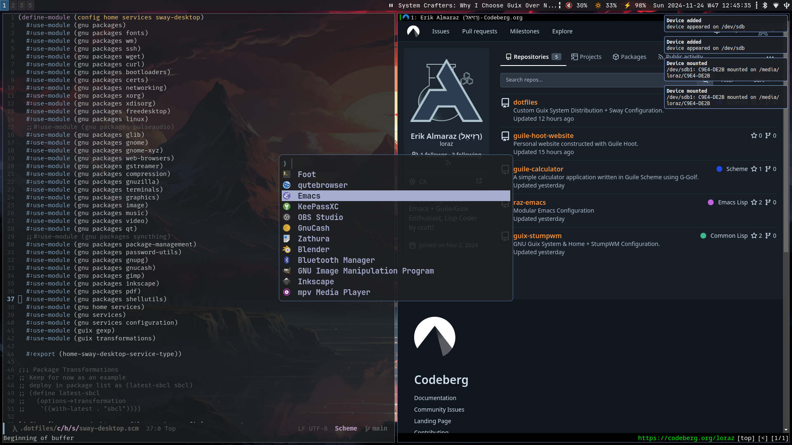
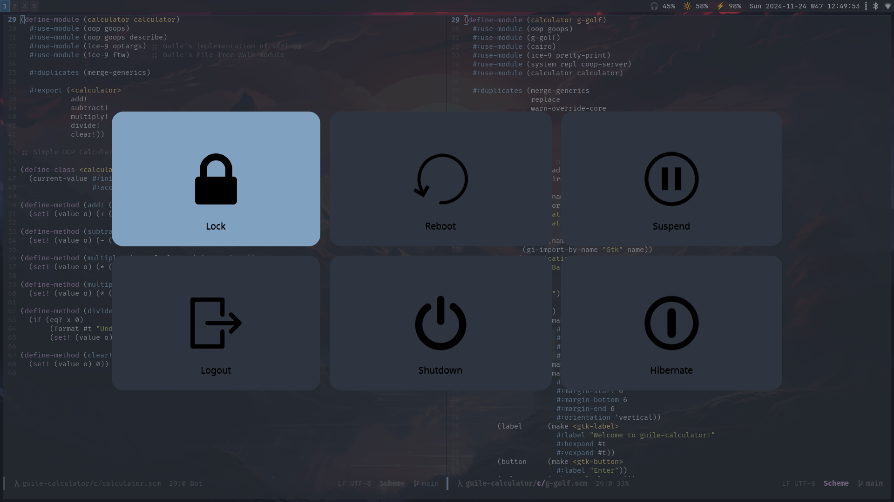

# GuixOS Sway

GuixOS Sway (codename GuixOS Phonon): A Custom Guix System Distribution
configured for Sway WM.

This is specifically setup and trailed with my Lenovo ThinkPad X1 Carbon
4th Gen (Type 20FB) Laptop.


## Screenshots






## Project Scaffolding

```scm
    guixos-sway/                   ;; Project Root
    |- config/
       |- home/                    ;; Home Config Root
          |- guixos-home.scm
          |- dot-bash_profile.sh               
          |- dot-bashrc.sh
          |- services/             ;; Home Service Modules
             |- emacs-guile.scm
             |- environment.scm
             |- raz-emacs.scm
             |- streaming.scm
             |- sway-desktop.scm
             |- udiskie.scm
             |- xdg-files.scm
       |- packages/                ;; Custom GuixOS Package Modules
          |- raz-emacs.scm
          |- video.scm
       |- services/                ;; Custom GuixOS Service Modules
          |- tbd
       |- system/                  ;; GuixOS Config Root
          |- guixos.scm            ;; ** GuixOS Config **
          |- guixos-base.scm       ;; WIP
          |- guixos-channels.scm
          |- channels.scm
    |- files/                      ;; XDG_CONFIG_HOME Files (=> xdg-files.scm)
       |- assets/...
       |- guile/...
       |- gtk-3.0/...
       |- foot/...
       |- vterm/...
       |- fuzzel/...
       |- mako/...
       |- wlogout/...
       |- qutebrowser/...
       |- gnupg/...    
       |- sway/                    ;; Sway Config (WIP => home-sway-service-type)
          |- config
          |- bin/
             |- swaybar-status.sh
             |- toggle-display.sh  ;; WIP
```


## Philosophy

 - Create a highly functional WM setup that is efficient & aesthetic 
 - Construct a modulur Guix System configuration as a Guile program
 - Handle customizations as custom Guix packages & services
 - Configure everything using Guile/Guix where possible!
 - Generalize to support setup on multiple machines
 - Optimize to create an efficient system for hacking in Guile Scheme
 - Eventually create a System/Home service utility that enhances Guix   


## Download & Install

First download and install Guix System from either of the release images below:

 - https://github.com/SystemCrafters/guix-installer
 - https://gitlab.com/nonguix/nonguix/-/releases

Once Guix has been installed from the release image, and the defined `channels`
file has be unlocked from a specific commit, do a `guix pull` to get to the
latest.

I personally use the SystemCrafters Guix release image as it comes
preconfigured with items that ease the pain of installation and the
instructions are excellent, see:
https://systemcrafters.net/craft-your-system-with-guix/full-system-install/

Next, download this project repo and edit the GuixOS configuration module
with your machine and user specific information, i.e. `swap-devices`,
`file-systems`, `user-account`, and `%user-name`. Note: See
"Establishing WiFi" section on a refresher for connecting to wifi via nmcli.

You probably won't have git installed, hence the `guix shell` command.

```bash

    $ guix shell git # Install git via guix shell...
    $ git clone https://codeberg.org/loraz/guixos-sway.git ~/.guixos-sway
    $ cd ~/.guixos-sway
    
    # Edit GuixOS configuration module
    $ emacs ./config/system/guixos.scm

```

Also, you will need to edit the following Home modules with your specific
information:

  - `/.config/home/services/xdg-files.scm` => `%user-name`
  - `/.config/home/services/environment.scm` => `%user-name`
  - [`./config/home/guixos-home.scm` => `home-bash-configuration`] 
    - Optional if you choose a different root project directory name...

Note: I am currently working to generalize this to define machine and user
specific variables in one place...

Now we are ready to install GuixOS Phonon:

```bash

    $ sudo guix system -L ~/.guixos-sway/ \
      reconfigure ~/.guixos-sway/config/system/guixos.scm

```

Once the initial install is complete, you will be able to reconfigure using
the command `gosr` if you choose to keep this project scaffolding, else you
will need to edit `home-bash-configuration` in `guixos-home.scm`.


## Establishing Wifi

This can be done with the UI via `nm-connection-editor`, but I like to keep
reference to `nmcli`. Working on figuring out how to establish a 'clickable'
swaybar icon to automatically bring up `nm-connection-editor`. stay tuned...

```bash
  # List Wifi networks available
  $ sudo nmcli device wifi list

  # Connect to ESSID
  $ sudo nmcli device wifi connect <ESSID> password <network-password>
```

List known connections and delete them from list in Network Manager.

```bash
  # Get ESSID (name) or UUID of connection to delete
  $ sudo nmcli connection show

  # Delete connection via ID (aka name or ESSID)
  $ sudo nmcli connection delete <ESSID>
```


## Establishing Bluetooth

Bluetooth works and is automatically deployed via bluez in Guix system config,
however, initial device connection first needs to be established via
`blueman-manager`.

Still working on better integration, such as auto-starting `blueman-applet`
in sway config, however, it currently has a bug in it's dbus service that has
yet to be addressed, see https://issues.guix.gnu.org/71528. Note this handles
bluetooth connection interfacing with sway, i.e. detection and notifications.
You can start it up in a shell (and get a ugly warning message) once in
your sway session - I usually don't and things still work, but with out
notifications...

## TODOs (Wish List)

 - Create base system config to apply to machine-specific configurations [Issue #4] 
 - Implement/Use bcacefs for file systems [Issue #5]
 - Minimize dependency on `xdg-files` (reserved for one-off's where possible)
 - Research solution to blueman-applet: https://issues.guix.gnu.org/71528

   
## References:

  - [Crafting a Minimal Sway Environment in Guix](https://systemcrafters.net/live-streams/september-27-2024/)
  - [How to Organize Your Guix Config](https://systemcrafters.net/craft-your-system-with-guix/how-to-organize-your-config/)

  - [Configuring Rational Emacs with Guix Home](https://systemcrafters.net/live-streams/july-8-2022/)
  - TBD
  - TBD
  - TBD
