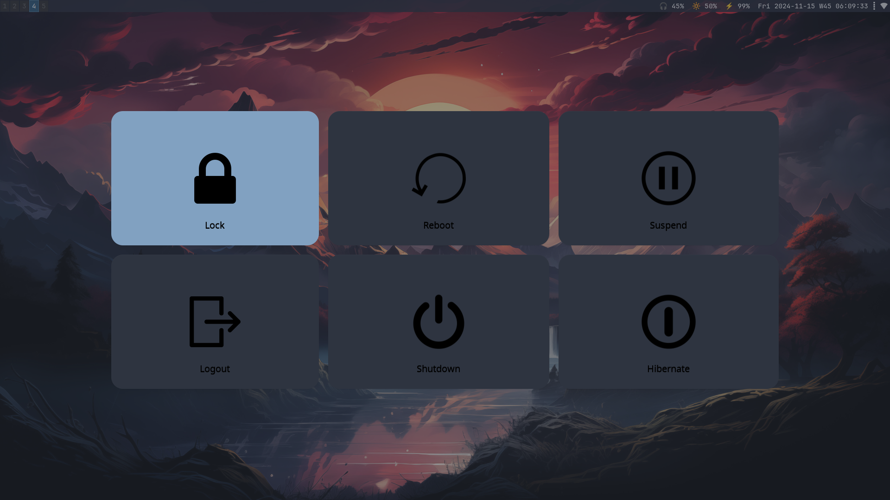

# dotfiles

Custom Guix System Distribution + Sway Configuration.


## Screenshots





## Project Scaffolding

```scm
    dotfiles/                        ;; Project root directory
    |- config/
       |- home/                      ;; Guix Home directory
          |- dot-bash_profile.sh
          |- dot-bashrc.sh
          |- home-config.scm         ;; Main Guix Home Config
          |- services/
             |- emacs-guile.scm
             |- environment.scm
             |- raz-emacs.scm
             |- sway-desktop.scm
             |- udiskie.scm
             |- xdg-files.scm
       |- packages/                  ;; Custom Packages
          |- raz-emacs.scm
       |- services/                  ;; System Services
          |- tbd
       |- system/                    ;; Guix System directory
          |- base-system.scm
          |- channels.scm
          |- system-config.scm       ;; Main Guix System Config
    |- files/                        ;; XDG_CONFIG_HOME Files
       |- assets/...
       |- foot/...
       |- gnupg/...
       |- gtk-3.0/...
       |- qutebrowser/...
       |- wlogout/...
       |- yambar/...                 ;; WIP as alternative to swaybar...               
       |- sway/                      ;; Sway WM Directory
          |- config                  ;; Main Sway config file
          |- bin/
             |- swaybar-status.sh    ;; Swaybar configuration
             |- toggle-display.sh    ;; WIP
```


## Goals

 - Create a highly functional WM setup that is efficient & aesthetically pleasing 
 - Construct a modulur Guix System configuration as a Guile program
 - Handle customizations as custom Guix packages & services
 - Configure everything using Guix/Guile (where possible)
 - Generalize to support setup on multiple machines
 - Optimize to create an efficient system for programing in Guile Scheme
 - Eventually create a System/Home service utility that enhances Guix   


## Download & Install

First download and install Guix System from either of the release images below:
    
 - https://gitlab.com/nonguix/nonguix/-/releases
 - https://github.com/SystemCrafters/guix-installer

Once Guix has been installed from the images do a `guix pull` and `guix system reconfigure`
to get to the latest.

Next, download this project repo and install as follows:

```bash
    $ git clone https://codeberg.org/loraz/dotfiles ~/.dotfiles
    $ cd ~/.dotfiles

    $ sudo guix system -L ~/.dotfiles/ reconfigure ~/.dotfiles/config/system/system-config.scm
    $ guix home -L ~/.dotfiles/ reconfigure ~/.dotfiles/config/home/home-config.scm
```


## Establishing Wifi

This can be done via also via `nm-connection-editor`, but I like to keep reference to `nmcli`
Working on figuring out how to establish a 'clickable' swaybar icon to automatically bring up
`nm-connection-editor`...

```bash
  # List Wifi networks available
  $ sudo nmcli device wifi list

  # Connect to ESSID
  $ sudo nmcli device wifi connect <ESSID> password <network-password>
```

List known connections and delete them from list in Network Manager.

```bash
  # Get ESSID (name) or UUID of connection to delete
  $ sudo nmcli connection show

  # Delete connection via ID (aka name or ESSID)
  $ sudo nmcli connection delete <ESSID>
```


## Establishing Bluetooth

Bluetooth works and is automatically deployed via bluez in Guix system config, however, initial
device connection first needs to be established via `blueman-manager`.

Still working on better integration, such as auto-starting `blueman-applet` in sway config, however, it
currently has a bug in it's dbus service that has yet to be addressed, see
https://issues.guix.gnu.org/71528. Note this handles bluetooth connection once device has been
established.


## References:

  - TBD
